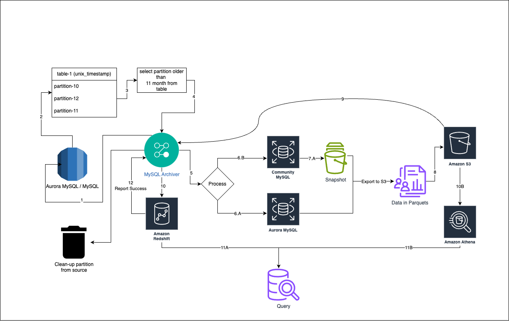

# MySQL Athena, S3 & Redshift based Partition Archiver

The automation is designed to peform deep archival for any mysql partitioned table from rds/aurora to s3 and athena for querying the data. The automation also supports importing data to redshift directly as well



## How it works?

The aim of this project is to archive data out from rds to s3 in dedicated bucket for x month.

- The automation will first create control table at the destination db
- The automation will pick the partition to archive using method `to_days` and `unix_timestamp`
- The automation will create exchange table on the target database
- The automation will exchange the new exchange table with the target partition
- The automation will record the change in control table
- The automation will create a snapshot of the target database in case its rds otherwise it will use aurora export directly
- The automation will partial export the exchanged table to the s3 bucket and table path
- The automation will import data to redshift (if required)
- The automation will cleanup all the resources related to archival, which includes cleaning exchange table and partition that was archived

## Environment Variables

To run this project, you will need to set the following environment variables while the redshift variables are optional

`MYSQL_USER`
`MYSQL_PASSWORD`
`REDSHIFT_USER`
`REDSHIFT_PASSWORD`

## Parameters

You are required to modify `env.py` file 

- `execution_role` = the arn of the aws execution role that will be used to export partial snapshot to s3

- `kms_key` = the arn of the kms key that will be used to export the partital snapshot to s3
## Onboard New Table
In order to onboard, new table follow the following steps

##### 1. Setup Directory 
 - Add a new folder under the config directory with `yaml`
 - for example: `configs/my_cool_app/fancy_env.yaml`

##### 2. Setup Table Configuration
 - Under the `yaml` add following properties for each table
```
- identifier: <value>
    the instance identifier of history rds/aurora
  
  is_cluster: <value>
    true if its aurora else false
  
  database_name: <value>
    the name of schema where table is present
  
  table_name: <value>
    the name of the table which needs scheduling
  
  method: <value>
    the partition method, acceptable values are to_days and unix_timestamps
  
  archive_period: <value> 
    the period to archive in months, for example 12 for on year old partitions
  
  s3_bucket: <value> 
    the name of the s3 bucket where data will be archived
  
  s3_archive_path: <value> 
    the path of the s3 bucket where data will be archived

  redshift_port: <value>
    the port on which redshift is operating, 
    the property is only required when rest of the redshift properties has been defined
    otherwise the property is optional
  
  redshift_database_name: <value>
    the database name where the table is created for import
    the property is only required when rest of the redshift properties has been defined

  redshift_schema_name: <value>
    the schema name where the table is located
    the property is only required when rest of the redshift properties has been defined

  redshift_table_name: <value>
    the table name where the data will be imported
    the property is only required when rest of the redshift properties has been defined

  redshift_import_columns: <value>
    the comma-separated list of columns that will be imported to redshit, for example id,col1,col2,col3
    the property is only required when rest of the redshift properties has been defined
```

## How to Run
After setting the environment, run `main` to start the process
`python3 automation/main.py <file_path>`

The script is designed to restart from the point of failure in case of crash in between so it should not be a problem.
